# Rhino Aid

Rhino Aid is a site that aims to provide people with information about rhino in Africa and how they can help save them from extinction. The site will target people who are interested in the conservation of rhinoceros and seek ways in which they can help protect them. Rhino Aid will be useful for users to gain knowledge about rhino in Africa and find out how they can take part in conserving them.

Visit the live site at [Rhino Aid](https://tony118g.github.io/rhino-aid/index.html)

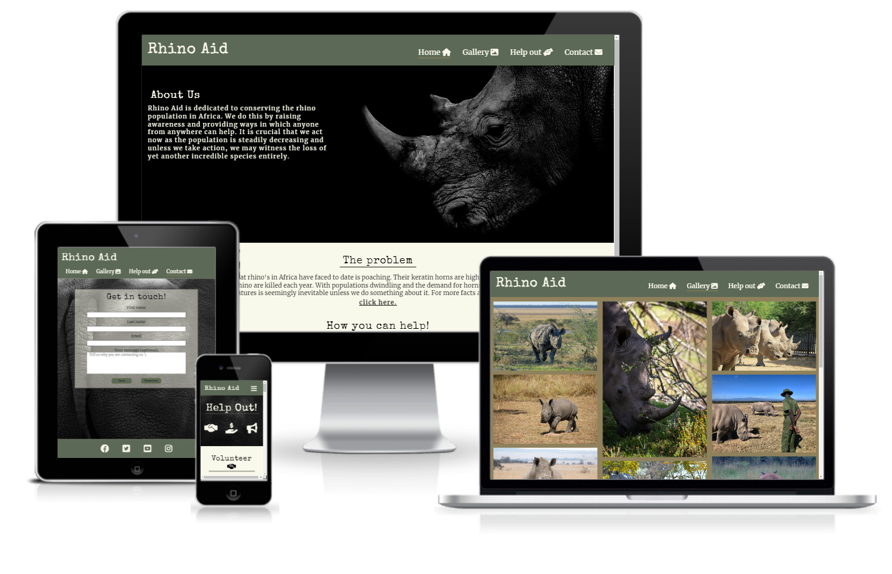

## Contents

* [User Experience](#user-experience)
    * [Site Structure](#site-structure)
    * [Font](#font)
    * [Colour Pallete](#colour-pallete)

* [Features](#features)
    * [existing features](#existing-features)
        * [Navigation Bar and Hamburger Menu](#navigation-bar-and-hamburger-menu)
        * [About Us section](#about-us-section)
        * [Middle Section (the problem)](#middle-section-the-problem)
        * [How You Can Help section](#how-you-can-help-section)
        * [Gallery](#gallery)
        * [Help Out Page](#help-out-page)
        * [Contact Page](#contact-page)
        * [Form Sent Page](#form-sent-page)
        * [Footer](#footer)
    * [Future Features](#future-features)

* [Technologies Used](#technologies-used)

* [Testing](#testing)

* [Deployment and Development](#deployment-and-development)
    * [Deploying the Site](#deploying-the-site)
    * [Forking the Repository](#forking-the-repository)
    * [Cloning the Repository](#cloning-the-repository)

* [Credits](#credits)
    * [Content](#content)
    * [Code](#code)
    * [Media](#media)

## User Experience

### User Stories

As a user I want to:
* understand what the site is about and what it provides upon landing.
* be able to navigate intuitively between pages.
* gain knowledge about rhino and how I can get involved in conserving them.
* easily obtain the information I am seeking.
* be able to easily get in contact with Rhino Aid.
* be able to connect with Rhino Aid via social media.

### Site Structure 

Rhino Aid is a site that consists of 4 main pages which are presented in the navigation menu. The main landing page is the home page with primary information. The user may then opt to navigate to any of the other pages ([gallery](https://tony118g.github.io/rhino-aid/gallery.html), [help-out](https://tony118g.github.io/rhino-aid/help-out.html) and [contact](https://tony118g.github.io/rhino-aid/contact.html)). The navigation menu sticks to the top of each page to allow easy access for users to navigate intuitively. The site also contains a form-sent page which is not available in the navigation menu and is presented to the user on completion and submition of the contact form in order to confirm the form submission.

#### Wireframes

I created basic wireframes of how I wanted the layout of the site to look on diferent devices. This was done using [Balsamiq](https://balsamiq.com/).

* Wireframes were created for the home, gallery and contact page. The layouts for the other pages were adopted from these so I did not find it neccessary to create separate wireframes that were nearly identical.
* The final version of the site differs in some ways due to changes that were made during the development.
    * The biggest difference is the conversion of two separate pages for "volunteer" and "donate" into a single "help-out" page.
    * This change was made to create a better user experience by providing all relevant information on how they can help on a single page, saving the user having to navigate back and forth and preventing repetition of certain content.

##### Home page wireframes

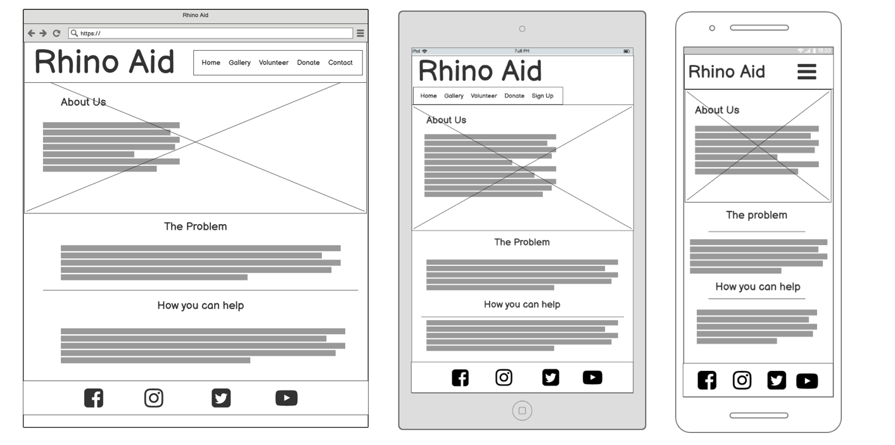

##### Gallery page wireframes

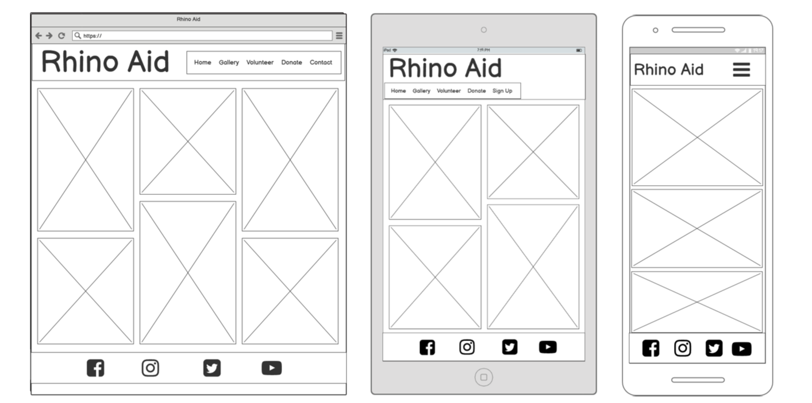

##### Contact page wireframes

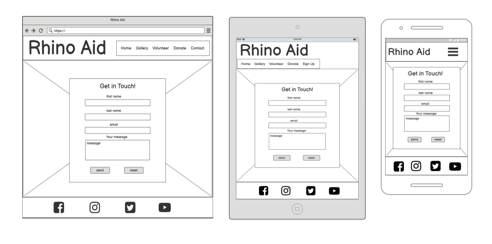

[Back to top](#contents)

#### Font

* The font used for the logo and headings is "special elite" with "sans-serif" as secondary font.
    * This font gives a rustic feel to the site and resembles nature in a way to complement the website theme.
* The font used in the body is "merriweather" also with "sans-serif" as secondary font.
    * This font complements the headings and logo and is well defined making it easy to read.

[Back to top](#contents)

### Colour Pallete

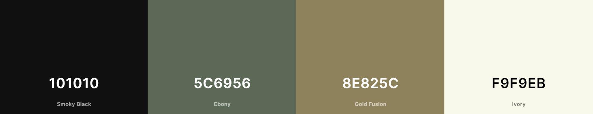

The colour scheme was chosen starting with a shade of green and then using [coolers](https://coolors.co/) I found colours that compliment it and are conjusive with the rhino theme.The ebony is used in the header and footer as well as a few borders and backgrounds on links and buttons. The ivory works well throughout as a background colour and font colour. The smokey black is used for font colour throughout creating good contrast. The gold fusion is used mainly on the gallery page background to make the images stand out and it works well with the colours in the images themselves, it is also used on a few borders.

[Back to top](#contents)

## Features

Rhino Aid is designed to be simple and easy to use, it is made up of various features for both small and large screens that contribute towards this such as a navigation bar/hamburger menu and well organised page content with links to direct users to appropriate pages.

[Back to top](#contents)

### Existing Features
* #### Navigation Bar and Hamburger Menu
    * Throughout all pages is a fully responsive navigation bar which collapses into a hamburger menu on smaller screens.It includes links to each of the pages on the website.
    * It is contained in the header which is fixed to the top of the viewport which means it is always accessable to users no matter where they are on the page.
    * This will allow users to navigate between pages on all screen sizes.

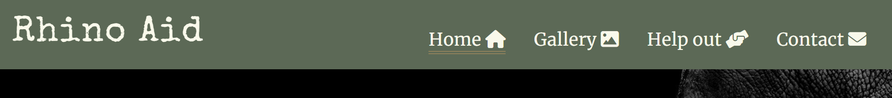
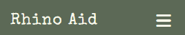

[Back to top](#contents)

* #### About us section
    * On the landing page is a background hero image with text over it describing what rhino aid is about.
    * The background image changes on different screen sizes to ensure there is no distraction from the foreground text.
    * This introduces the user to rhino aid and presents them with information on what to expect in the page.
    
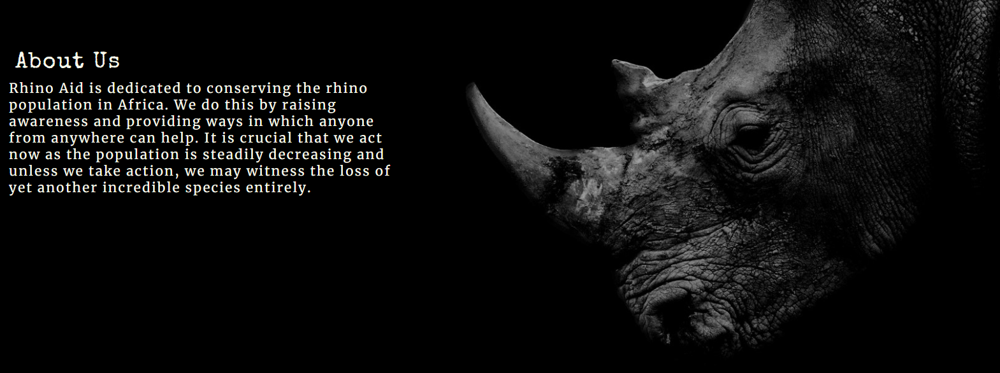
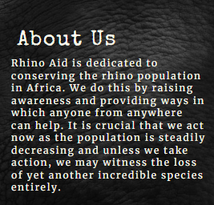

[Back to top](#contents)

* #### Middle section (The problem)
    * This section provides the user with information about the problem rhino in africa are facing with a link to an external website that opens in a separate tab where they can find more details and information on the topic.

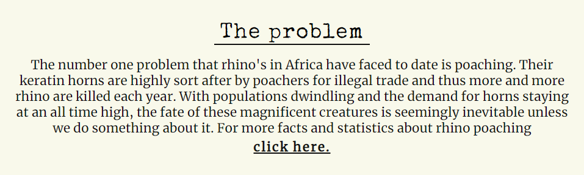

[Back to top](#contents)

* #### How You Can Help Section
   * This section provides a summary of how the users can help conserve rhino and contains a link which directs the user to the help-out page for more information.

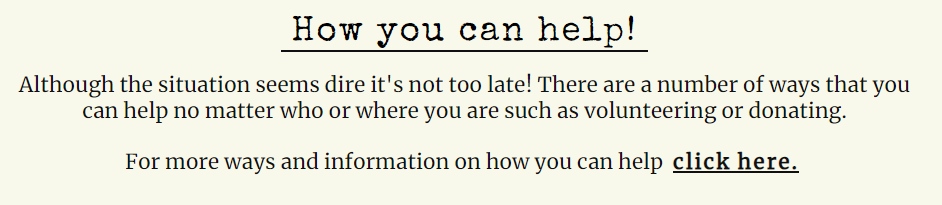
    
[Back to top](#contents)

* #### Gallery
    * The gallery is a page which users have access to through the navbar or hamburger menu.
    * It is useful to users for viewing images of rhino and provides a visual aspect to the site and its intentions. 

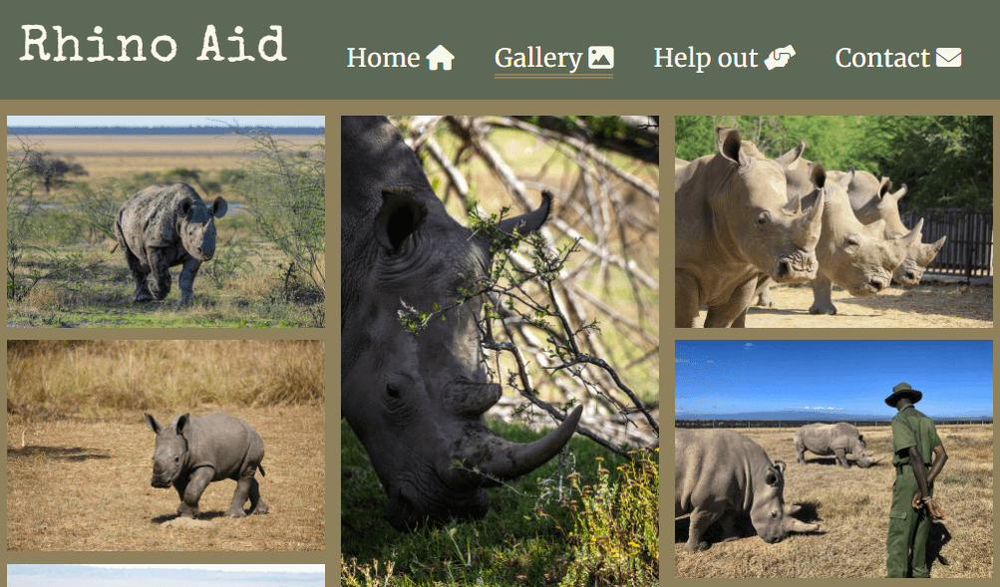

[Back to top](#contents)

 * #### Help Out page
    * This a page dedicated to providing ways in which users can help conserve rhino.
    * The users can navigate to this page throught the navigation bar/hamburger menu or through the link in the how you can help section of the home page.
    * It includes 3 different sections containing ways of helping, each with descriptions on how to go about it.
    * The first two sections (volunteer and donate) contain links to external websites to help users further along the process of volunteering or donating.
    * This page is useful to users to gain valuable information about how exactly they can can help and aids in the process of choosing which way is best for that user.

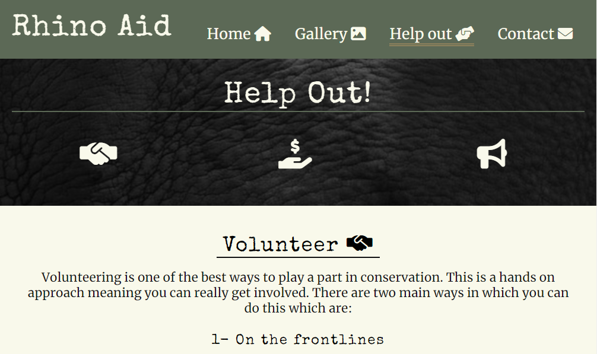

[Back to top](#contents)

* #### Contact Page
    * The contact page contains a form which the user can fill out to get in touch with rhino aid.
    * The form includes inputs for the users name and email-address as well as a textarea which the user may use to send a message or explain why they are contacting rhino aid.
    * At the bottom of the form is a submit button and a reset button.
    * Upon completion the user clicks the submit button which directs them to a page confirming the form has been sent.
    * This page is useful as it creates a way for users to stay in touch and communicate directly with rhino aid.

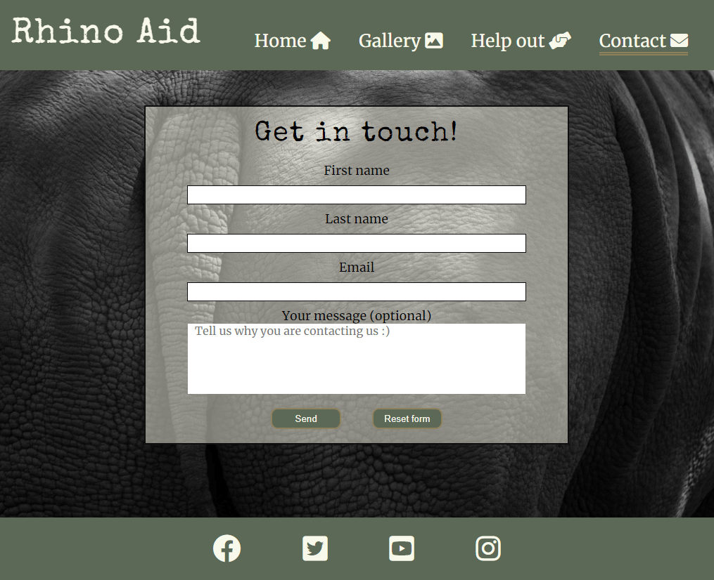

[Back to top](#contents)

* #### Form Sent Page
    * This is where the user is directed to after submitting the contact form.
    * It conveys a message to the user thanking them for getting in touch and stating that rhino aid will reply in due time.
    * This page is useful to users as it provides confirmation that their form and information has been submitted and provides the user with a sense of engagement.

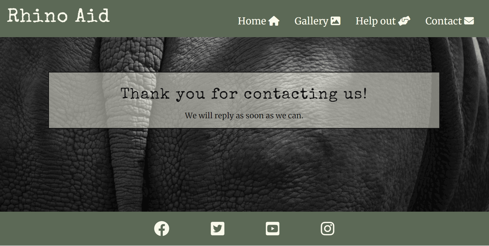

[Back to top](#contents)

* #### Footer
    * The footer is located at the bottom of each page and is identical througout the site.
    * It provides the user with social media links that open in a separate tab and helps the user stay in contact through social media.

[Back to top](#contents)

### Future Features

* A "donate" page where users can donate directly through the rhino aid site.
    * This would involve a functioning form with extensive inputs for various donation charities and organisations.
* A "volunteer" page where users can book volunteer programs directly through rhino aid.
    * This would also involve a functioning form with extensive inputs for various programs.
* A dropdown menu list on the help-out navigation link with links to different associated pages such as the donate or volunteer page.

[Back to top](#contents)

## Technologies Used

* [HTML5](https://html.spec.whatwg.org/)
    * Used to create website structure and content.
* [CSS](https://www.w3.org/Style/CSS/Overview.en.html)
    * Used to style the html.
* [Gitpod](https://www.gitpod.io/#get-started)
    * Used to create code and repository content.
* [Github](https://github.com/)
    * Used to store the repository and deploy the site.
* [Balsamiq](https://balsamiq.com/wireframes/)
    * Used to create wireframes.

[Back to top](#contents)

## Testing

Please click [here](TESTING.md) for more information on testing Rhino Aid.

## Deployment and Development

### Deploying the Site

*  The deployment of the site was done through github pages through the following steps:
    1. In the rhino-aid github repository, click on settings.
    2. Scroll down and select the pages tab.
    3. In the branch dropdown menu, select "main".
    4. Click save.
    5. Refresh the page to view deployed website link.

The repository link is [here](https://github.com/Tony118g/rhino-aid)

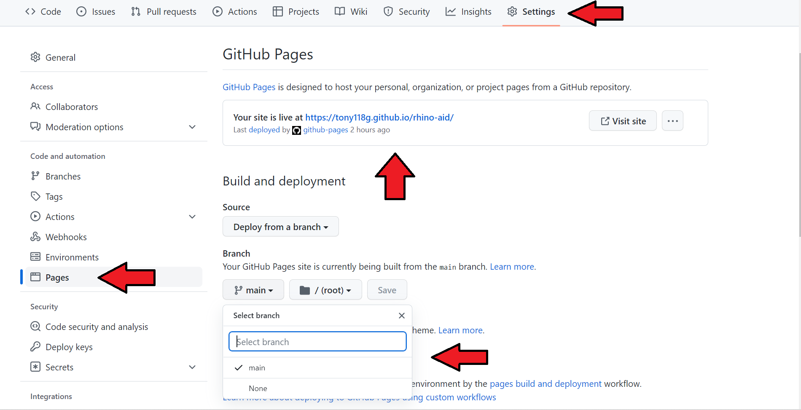

[Back to top](#contents)

### Forking the repository
* Forking the repository can also be done on github.
    * Forking may be done in order to create a copy of the repository if one wishes to edit it without making changes to the original repository.
    * This can be done throught the following steps:
    1. On the rhino-aid repository, find the "fork" tab in the top right corner.
    2. Click on the "fork" tab.
    3. Click on "create fork".

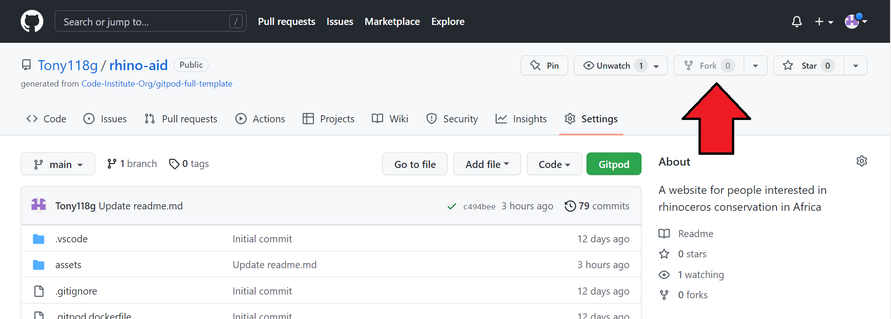

[Back to top](#contents)

### Cloning the repository
* Cloning the repository can also be done on github.
    * Cloning a repository may be done in order to create a local copy on a computer.
    * This can be done through the following steps:
    1. On the rhino-aid repository, click on the "code" tab located just above the list of files and next to the gitpod button.
    2. Ensure https is selected in the dropdown.
    3. Click on the clipboard icon under https to copy the url.
    4. Open Git Bash.
    5. Change the current working directory to the location where you want the cloned directory to be created.
    6. Type in "git clone" followed by pasting the url that was copied from the repository.
    E.g.  "git clone https://....."
    7. Press enter to create the clone.

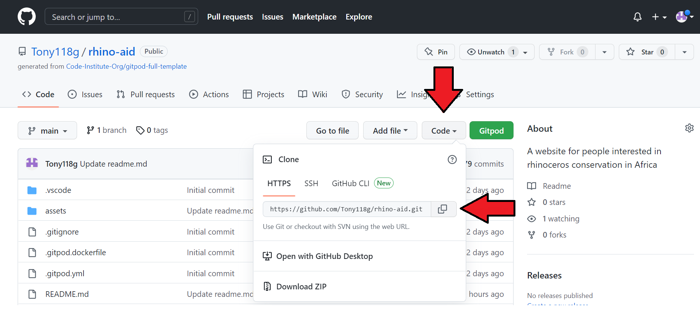

[Back to top](#contents)

## Credits

### Content
* Fonts were taken from [Google Fonts](https://fonts.google.com/)
* The icons used throughout the site were from [font awesome](https://fontawesome.com/)
* The colour pallete was generated using [coolers](https://coolors.co/)
* I linked to a [Poaching Facts](https://www.poachingfacts.com/poaching-statistics/rhino-poaching-statistics/) external website in the home page where users can find more information about rhino poaching and statistics.
* I included the following external links in the help-out page as examples of sites that offer volunteering and donating:
    * For "Care For Wild":
    [Care for wild volunteer page](https://careforwild.co.za/volunteer) and [Care For Wild Donate page](https://shop.careforwild.co.za/donate/)
    * For "Imire":
    [Imire volunteer page](https://www.imire.co.zw/volunteer/)  and [Imire donate page](https://www.imire.co.zw/support/)
    * For "Save The Rhino":
    [Save The Rhino volunteer page](https://www.savetherhino.org/get-involved/volunteer/) and [Save The Rhino donate page](https://www.savetherhino.org/get-involved/donate)
* A guidline and ideas of content to be included in the readme.md came from [this readme](https://github.com/EwanColquhoun/wawaswoods#readme) and [The code institute template](https://github.com/Code-Institute-Solutions/readme-template) 
* Information on how to fork and clone repositories was researched at [Github Docs](https://docs.github.com/en)

[Back to top](#contents)

### Code
* Instructions and ideas on how to create a hamburger menu were taken from [this online source](https://code-boxx.com/simple-responsive-pure-css-hamburger-menu/)
* Html code for the social links in the footer was taken from the [love running project](https://github.com/Tony118g/love-running)

### Media
* Images used throughout the site were taken from [pexels](https://www.pexels.com/)
* I used [TinyPNG](https://tinypng.com/) to compress images.

[Back to top](#contents)