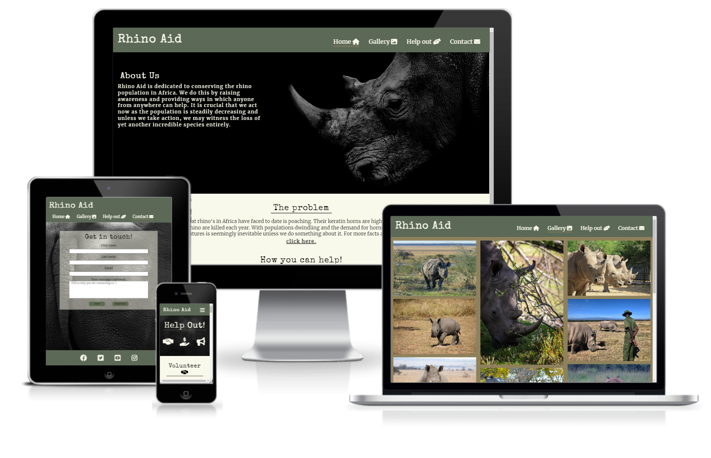
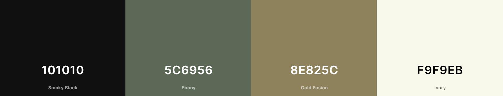
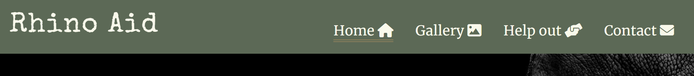

# Rhino Aid

Rhino Aid is a site that aims to provide people with information about rhino in Africa and how they can help save them from extinction. The site will target people who are interested in the conservation of rhinoceros and seek ways in which they can help protect them. Rhino Aid will be useful for users to gain knowledge about rhino in Africa and find out how they can take part in conserving them.

Visit the live site at [Rhino Aid](https://tony118g.github.io/rhino-aid/index.html)

## Contents

## Site Structure

Rhino Aid is a site that consists of 4 main pages which are presented in the navigation menu. The main landing page is the home page with primary information. The user may then opt to navigate to any of the other pages ([gallery](https://tony118g.github.io/rhino-aid/gallery.html), [help-out](https://tony118g.github.io/rhino-aid/help-out.html) and [contact](https://tony118g.github.io/rhino-aid/contact.html)). The navigation menu sticks to the top of each page to allow easy access for users to navigate intuitively. The site also contains a form-sent page which is not available in the navigation menu and is presented to the user on completion and submition of the contact form in order to confirm the form submition.

## Font

* The font used for the logo and headings is "special elite" with "sans-serif" as secondary font.
    * This font gives a rustic feel to the site and resembles nature in a way to complement the website theme.
* The font used in the body is "merriweather" also with "sans-serif" as secondary font.
    * This font complements the headings and logo and is well defined making it easy to read.

## Colour Pallete

The colour scheme was chosen starting with a shade of green and then using [coolers](https://coolors.co/) I found colours that compliment it and are conjusive with the rhino theme.The ebony is used in the header and footer as well as a few borders and backgrounds on links and buttons. The ivory works well throughout as a background colour and font colour. The smokey black is used for font colour throughout creating good contrast. The gold fusion is used mainly on the gallery page background to make the images stand out and it works well with the colours in the images themselves, it is also used on a few borders.

## User Experience

## Features

Rhino Aid is designed to be simple and easy to use, it is made up of various features for both small and large screens that contribute towards this such as a navigation bar/hamburger menu and well organised page content with links to direct users to appropriate pages.
### Existing Features
* Navigation Bar and Hamburger Menu
    * Throughout all pages is a fully responsive navigation bar which collapses into a hamburger menu on smaller screens.It includes links to each of the pages on the website.
    * It is contained in the header which is fixed to the top of the viewport which means it is always accessable to users no matter where they are on the page.
    * This will allow users to navigate between pages on all screen sizes.

    
    
* Landing page image and about us

    * On the landing page is a full screen image with text over it describing what rhino aid is and what it provides.
    * This introduces the user to rhino aid and presents them with information on what to expect in the page.
* Middle section (The problem)
    * This section provides the user with information about the problem rhino in africa are facing with a link to an external website that opens in a separate tab where they can find more details and information on the topic.
* How You Can Help Section
    * This section provides ways in which the user can take part in helping the rhino in africa with different options available.
    * The user is given options and is pointed in the direction of the relavant pages associated with each option through links in the section or in the navigation bar.
* The gallery
    * The gallery is a page which users have acces to through the navbar or hamburger menu.
    * It is useful to users for viewing images of rhino and provides a visual aspect to the site and its intentions. 
 * The Help Out page
    * This a page dedicated to providing ways in which users can help conserve rhino.
    * It includes 3 different sections containing ways of helping, each with descriptions on how to go about it.
    * The first two sections (volunteer and donate) contain links to external websites to help users further along the process of volunteering or donating.
    * This page is useful to users to gain valuable information about how exactly they can can help and aids in the process of choosing which way is best for that user.
* Contact Page
    * The contact page contains a form which the user can fill out to get in touch with rhino aid.
    * The form includes inputs for the users name and email-address as well as a textarea which the user may use to send a message or explain why they are contacting rhino aid.
    * At the bottom of the form is a submit button and a reset button.
    * Upon completion the user clicks the submit button which directs them to a page confirming the form has been sent.
    * This page is useful as it creates a way for users to stay in touch and communicate directly with rhino aid.
* Form Sent Page
    * This is where the user is directed to after submitting the contact form.
    * It conveys a message to the user thanking them for getting in touch and stating that rhino aid will reply in due time.
    * This page is useful to users as it provides confirmation that their form and information has been submitted and provides the user with a sense of engagement.
* The footer
    * The footer is located at the bottom of each page and is identical througout the site.
    * It provides the user with social media links that open in a separate tab and helps the user stay in contact through social media.
    
## Testing

## Deployment
* The deployment of the site was done through github pages through the following steps:
    * In the rhino-aid github repository, click on settings.
    * Scroll down and select pages tab.
    * In the branch dropdown menu, select "main".
    * Save to deploy.
    * The website is now deployed.
## Credits
### Content
* A guidline layout for the readme.md was taken from [The code institute template](https://github.com/Code-Institute-Solutions/readme-template) 
* Instructions and ideas on how to create a hamburger menu were taken from [this online source](https://code-boxx.com/simple-responsive-pure-css-hamburger-menu/)
* The icons used throughout the site were taken from [font awesome](https://fontawesome.com/)
* I linked to a [Poaching Facts](https://www.poachingfacts.com/poaching-statistics/rhino-poaching-statistics/) website where users can find more information about rhino poaching and statistics.
* I included the following external links in the help-out page as examples of sites that offer volunteering and donating:
    * For "Care For Wild":
    [Care for wild volunteer page](https://careforwild.co.za/volunteer) and [Care For Wild Donate page](https://shop.careforwild.co.za/donate/)
    * For "Imire":
    [Imire volunteer page](https://www.imire.co.zw/volunteer/)  and [Imire donate page](https://www.imire.co.zw/support/)
    * For "Save The Rhino":
    [Save The Rhino volunteer page](https://www.savetherhino.org/get-involved/volunteer/) and [Save The Rhino donate page](https://www.savetherhino.org/get-involved/donate)

### Media
* All images used throughout the site were taken from [pexels](https://www.pexels.com/)
