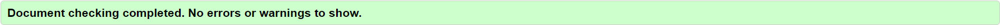
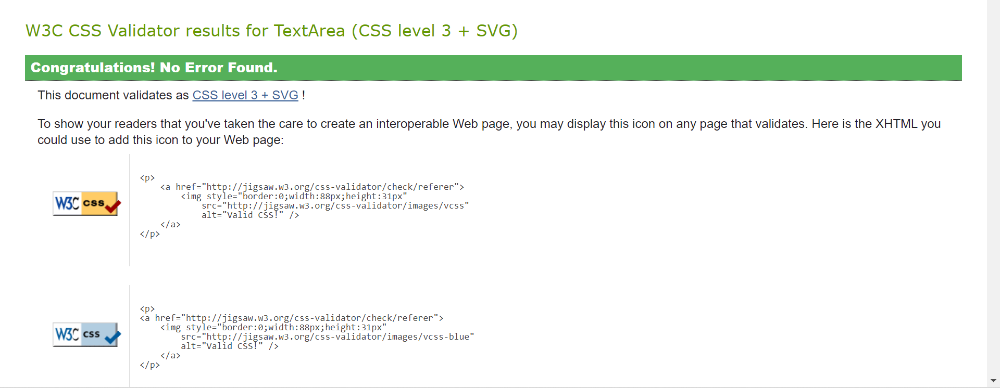
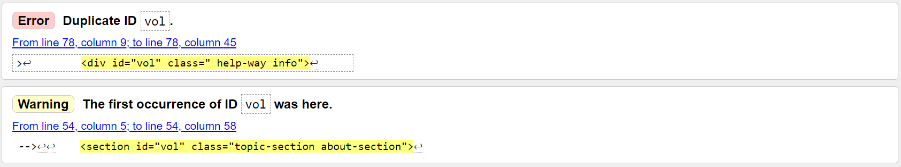
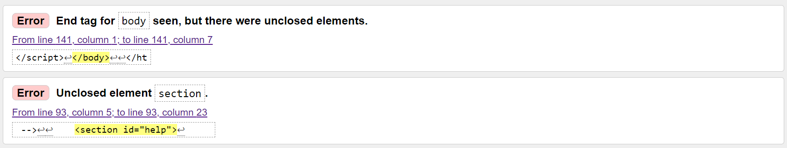
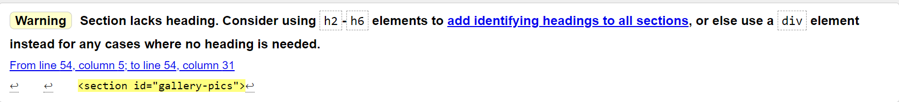
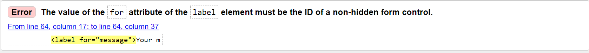
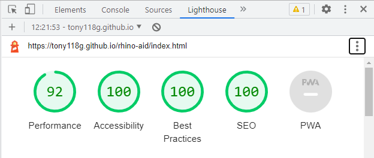

# Testing

## Code Validation

The Rhino Aid site has been tested extensively through development. All html code has been run through the [W3C html Validator](https://validator.w3.org/) and the css code has been run through the [W3C css Validator](https://jigsaw.w3.org/css-validator/).

* A few errors were found in both the html and css code but after fixing these and rerunning the code no errors were found throughout.
    * To find out more about the errors that arose please see the [known Bugs](#known-bugs) section.

### W3C html validator results

* Home page (index.html)

    

* Gallery page (gallery.html)

    

* Help out page (help-out.html)

    

* Contact page (contact.html)

    

* Form sent page (form-sent.html)

    

### W3C css validator results

## Responsiveness Test

Responsiveness testing was carried out throughout the development of the site using [Google Chrome Devtools](https://developer.chrome.com/docs/devtools/) and the [Responsive Design Checker](https://responsivedesignchecker.com/).

* I built the site using a mobile first approach and then added media queries for medium and large screens.
* During development I then ended up adding another media query for very small screens to cater for smaller mobiles. The original coding for the header caused the logo to drop down in order to fit the font and so reducing the font size and adding a few other style rules for screens < 375px fixed the problem.
* During a certain phase of development I replaced two pages in the navbar (volunteer and donate) with a single "help out" page.
    * Following this I tried changing the breakpoints for media queries to cater for a smaller navbar however I discovered that the affects were too detrimental to the rest of the site and had too little effect on the navbar to warrant the change so I reverted back to the original breakpoints.

Once I had made necessary changes, I carried out tests on the site on various devices, these are the results I obtained:

|       | Galaxy s9+|Galaxy s5|Nexus 4|iphone XR|ipad mini|ipad pro|10" notebook|19" desktop|24" desktop 
:-----  | :----:    | :-----: |:-----:| :-----:  | :-----:  | :-----: | :-----:     | :-----:    | :-----:
render  | pass      | pass    | pass  | pass     | pass     | pass    | pass        | pass       | pass
images  | pass      | pass    | pass  | pass     | pass     | pass    | pass        | pass       | pass
links   | pass      | pass    | pass  | pass     | pass     | pas     | pass        | pass       | pass

## Browser Compatibility

The Rhino Aid site was tested on the following browsers:
* Google Chrome
* Microsoft Edge
* Safari

No issues were found across these browsers and the appearance, functionality and responsiveness were consistent throughout.

## Testing User Stories

As a user I want to:

* understand what the site is about and what it provides upon landing.
    * The "Rhino Aid" logo provides an idea of the purpose of the site.
    * Just below the header on the landing page is an "About us" section with a summary of what Rhino Aid is about and a background image of a rhino on large screens and rhino hide on small screens.

* be able to navigate intuitively between pages.
    * At the top of each page is an identical header with a navbar for large screens or hamburger menu for small screens.
    * The header is fixed to the top of the viewport making it readily accessible to the user no matter where they are on the site.
    * In the home page "how you can help" section is an additional link to the "help-out page" to assist users in knowing where to go next.

* gain knowledge about rhino and how I can get involved in conserving them.
    * The home page contains a summary about the rhino situation in Africa with a link to an external site which opens in a separate tab.
        * This provides users with the option to discover more details about Rhino and their situation.
    * The "Help out" page provides users with ways and options of how they can get involved, each with a description to allow the user to choose which would best suit them.
        * Two of the options mentioned above contain links to suggested sites (that open in a separate tab) which users may use in order to help them further along each respective way of getting involved.

* easily obtain the information I am seeking.
    * A descriptive navigation menu allows users to access the relevant page they are looking for.
    * The site is well layed out with a simple structure and intuitive design to ensure users can obtain the relevant information they require.

* be able to easily get in contact with Rhino Aid.
    * The "Contact" page is linked to in the navbar and/or hamburger menu making it easy to locate and access.
    * The form is basic and well structured with an option to input a message that the user may want to send.
    * Submit and reset buttons are clearly defined in the form.

* be able to connect with Rhino Aid via social media.
    * The footer is on every page and contains social media links.

## Known Bugs

### Resolved

During validation, the following bugs were found:

* Across all html pages:

    

    * This was a result of duplicating the nav for a navbar and hamburger menu without changing the id for one of them.
    * It was easily fixed by removing the id="navbar" and replacing it with id="burger-menu"
    
* Home page:

     

     * This was a result of accidentally removing the section closing tag during coding.
     * The fix was done by adding the necessary closing tag.

* Gallery page:

    

    * This warning occured because I used a section element to contain my images without a heading.
    * To fix this I replaced the section element with a div element.

* Contact page:

     

     * This error came up because the "for" attribute in a label element did not match the id of the element it was required to label.
     * I amended this by typing in the correct, matching value for the attribute.

Other major amendments were as follows:

* On very small screens The font size of the logo caused it to drop down and take up two lines which took up too much space on the viewport.
    * After reducing the font-size for screens < 375px the header returned to the intended size.

* On the home page on very large screens which had a height greater than the contents of the page, the footer was lifted above the bottom of the viewport.
    * To fix this, I wrapped the page contents in a div and styled it, giving it a height to push the footer to the bottom of the viewport.
    * I did not find it neccessary to apply this to other pages as it is unlikely that the viewport height would exceed the contents of those pages.

* When filling in the form on mobile devices, the pop-up keyboard would cause the page structure to change and the form would overlap the footer creating an undesireable and confusing effect. On large screens the footer on the contact page was raised off the bottom of the viewport.
    * I amended this by changing the height in css to a value using calc(100vh - x) with x being the combined hieght of the header and footer.
    * I also set the overflow to scroll in css.
    * This fixed the problem allowing the user to easily fill out the form without any changes affecting the layout or presentation.

### Unresolved

* The form in the contact page acts as expected on the surface and acknowledges input of data however the data does not push anywhere.
    * This is due to a limitation within this project and would be rectified for a true deployment of the Rhino Aid site.

## Additional Testing

### Lighthouse

I used the [Google lighthouse](https://developer.chrome.com/docs/lighthouse/overview/) test in Chrome Developer Tools to test each page on the site. This was used to test the following:

* Performance
* Accessibility
* Best Practices
* SEO

During development, when I used the lighthouse test, the results for performance were very poor.This was mainly due to the images being very large in size causing them to load too slowly.

* I replaced the images with versions that were much smaller at less than 300kb. This drastically improved the loading time and in turn resulted in a favourable performance.

The final results were overall very positive. An example of the home page lighthouse results are below.

 

### Peer Review

In addition to the obove tests and procedures, the site was reviewed by my code institute peers and they tested it on their various devices and browsers.

The majority of the feedback was positive with a few suggestions which I emplemented as follows:
* To change the colour of the text in form submit buttons for better contrast.
* To add padding to the gallery to create a bigger gap between the footer and bottom of the images section.
* A peer pointed out the problem with the footer being raised on large screens in the contact page which I mentioned in the [known bugs](#known-bugs) resolved section. This problem was fixed.

Return to [README.md](README.md)
